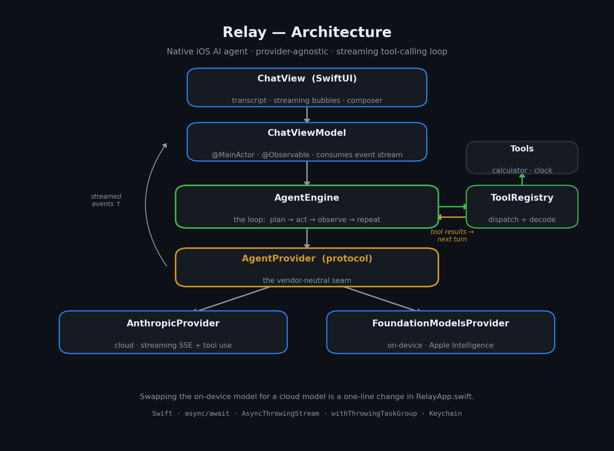

<h1 align="center">🛰️ Relay</h1>

<p align="center">
  <strong>A native iOS AI agent built in SwiftUI.</strong><br>
  Type in natural language → it streams a response, calls tools mid-reasoning,<br>
  and shows its work — on-device-ready, vendor-agnostic, production-minded.
</p>

<p align="center">
  
  
  
  
</p>

---

## ✨ What it does

Relay is a conversational AI agent that runs as a native iOS app. You ask a
question; it streams the answer token by token, and when an exact answer is
needed it **calls a tool** (calculator, clock, …), shows that step inline, then
keeps reasoning until it can reply.

It was built to demonstrate one specific intersection: **on-device-first AI,
delivered through a polished native interface, with production-grade engineering
underneath.**

> **Example:** *"What's 18% of 240, and what's today's date?"*
> → Relay calls `calculator`, calls `current_datetime`, then answers in one reply.

<!--
  📸 SCREENSHOT / DEMO GIF GOES HERE.
  After you build and run the app, record a short clip of the agent streaming a
  response and calling a tool inline, then drop it in:

  <p align="center"></p>

  A real GIF here is worth more than any paragraph — it proves the app runs.
-->

---

## 🧠 Architecture

<p align="center">
  
</p>

The whole app is written against a single **`AgentProvider`** protocol — the
vendor-neutral seam. That's what lets Apple's on-device Foundation Models and a
cloud model be interchangeable (a one-line change in `RelayApp.swift`).

- **`AgentEngine`** owns the loop — *plan → act → observe → repeat* — running
  tools in parallel via a task group and stopping on a final answer or step cap.
- **`AnthropicProvider`** parses Server-Sent Events live: text deltas surface
  immediately, while tool-call arguments (which arrive as JSON fragments across
  many events) are reassembled before the tool runs.
- **`ChatViewModel`** is `@MainActor` + `@Observable`, so every UI mutation is
  main-thread-safe by construction.

Full design rationale and trade-offs in [`ARCHITECTURE.md`](ARCHITECTURE.md).

---

## 🛠 Tech stack

| Area | What |
|------|------|
| UI | SwiftUI, `@Observable`, `@MainActor` |
| Concurrency | `async/await`, `AsyncThrowingStream`, `withThrowingTaskGroup` |
| Networking | `URLSession.bytes` SSE streaming |
| AI | Tool-calling agent loop · Anthropic Messages API · Apple FoundationModels (on-device) |
| Security | API key stored in Keychain |
| Testing | XCTest coverage on tools + registry |

---

## 🚀 Run it

1. Open Xcode 16+ and create a new **iOS App** named `Relay` (SwiftUI).
2. Delete the generated `ContentView.swift`, then drag the files from `Relay/`
   into the project, preserving the group structure.
3. Add `RelayTests/` to the test target.
4. Build and run, tap the gear icon, and paste an Anthropic API key (stored in
   the Keychain).
5. Try: **"What's 18% of 240, and what's today's date?"**

> **On-device mode:** a `FoundationModelsProvider` is included behind
> `#if canImport(FoundationModels)`. Build with the SDK that ships Apple's
> on-device model, run on an Apple Intelligence-capable device, and switch the
> provider line in `RelayApp.swift` — no API key required.

---

## ➕ Adding a capability

A new agent skill is one new file:

```swift
struct WeatherTool: AgentTool {
    let name = "get_weather"
    let description = "Get the current weather for a city."
    var inputSchema: JSONSchema {
        JSONSchema(properties: ["city": .init(type: "string",
                   description: "City name")], required: ["city"])
    }
    func run(arguments: [String: JSONValue]) async throws -> String {
        // call a weather API, return a string the model reads next turn
    }
}
```

Register it in `RelayApp.swift` — the model can use it immediately. No engine,
view, or view-model changes.

---

## 📄 License

MIT — see [LICENSE](LICENSE).
